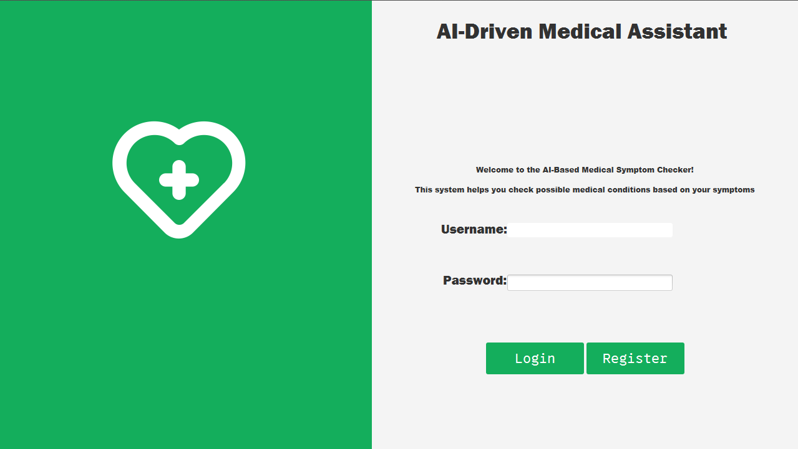
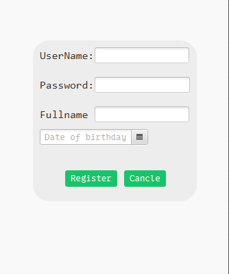
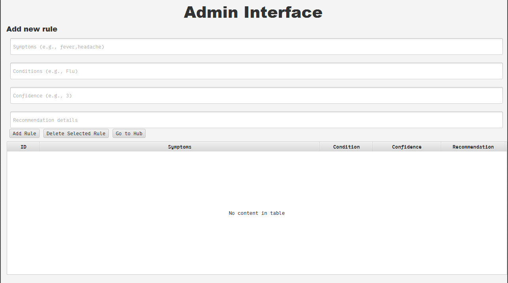
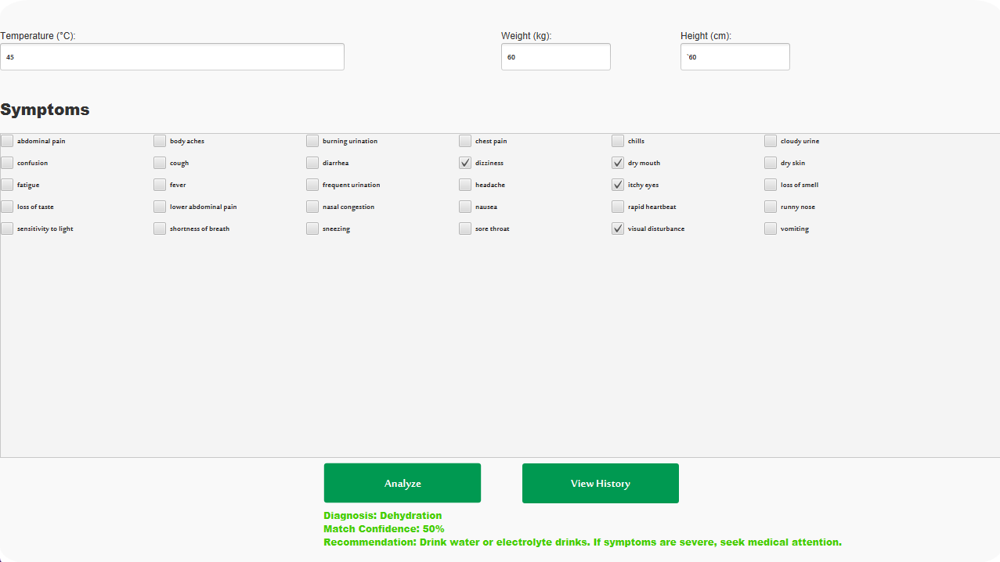
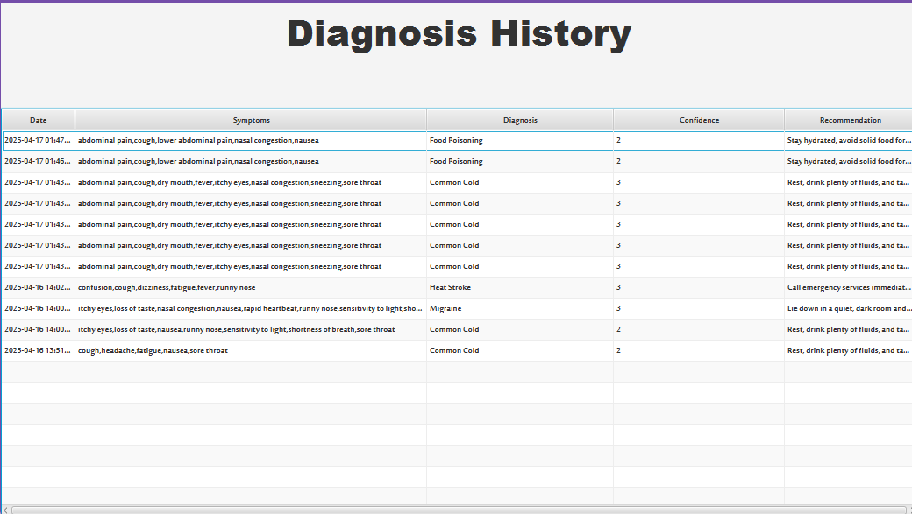

# 💻 AI-Driven Medical Assistant (JavaFX)

This project is a desktop-based AI-powered Medical Assistant built using **JavaFX**. It helps users diagnose potential medical conditions based on entered symptoms, and provides health recommendations. The system includes a simple **authentication system**, **admin panel**, and **symptom checker**.

---

## 🚀 Features

- ✅ **JavaFX Desktop GUI** – Clean, intuitive interface for users and admins.
- 🧠 **AI Rule-Based Diagnosis** – Diagnoses conditions based on selected symptoms and rule confidence.
- 🔐 **Login/Register** – Secure and lightweight authentication system.
- 👨‍⚕️ **Admin Panel** – Add and manage diagnostic rules.
- 📋 **Symptom Form** – User-friendly form to input symptoms, temperature, weight, and height.
- 📜 **Diagnosis History** – Stores past user results with full traceability.

---

## 📷 Screenshots & Descriptions

### 1. 🔐 Login Interface

> User login screen where registered users can enter their credentials to access the system.

---

### 2. 📝 Register Interface

> New users can create an account by entering username, password, full name, and date of birth.

---

### 3. ⚙️ Admin Interface

> Admins can add new diagnostic rules by specifying symptoms, condition, confidence level, and recommendation.

---

### 4. 💡 Symptom Checker

> Users input their temperature, weight, height, and select symptoms to analyze their condition.

---

### 5. 📖 Diagnosis History

> Displays a log of all previous diagnoses with symptoms, matched condition, confidence level, and medical advice.

---

## 🛠️ How to Run the Project

### 🧰 Requirements:
- Java Development Kit (JDK) 8 or higher
- JavaFX SDK (if using JDK < 11)
- IDE like IntelliJ IDEA, Eclipse, or NetBeans

### ▶️ Steps to Run:

## if you want try the project go to INSTALLATION.md

## 🙏 Acknowledgments

We would like to express our sincere appreciation to everyone who contributed to the development of this project. Special thanks to all team members for their efforts, collaboration, and dedication throughout all stages of building this AI-driven medical assistant.

Contributors:
- [ِAbdulelah Nasser]
- [Abdullah Alamri]

